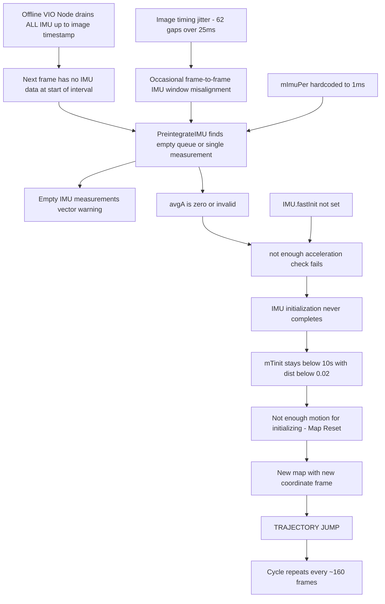

# Fix OA-SLAM VIO Trajectory Jumps — Root Cause Analysis & Plan

## Executive Summary

The OA-SLAM VIO system produces **10 map resets** during a 30-second sequence, each causing a trajectory discontinuity (jump). The root cause is a **combination of IMU data delivery bugs in the offline VIO node and overly strict IMU initialization thresholds** in ORB-SLAM3, exacerbated by moderate image timing jitter in the rosbag.

---

## Investigation Findings

### 1. Log Analysis (Data/tmp1.txt)

| Metric | Value |
|--------|-------|
| Total frames processed | 1769 |
| Map resets | 10 |
| Maps created | 11 |
| "Empty IMU measurements" events | 30+ |
| "not enough acceleration" warnings | Escalating (2 → 48 per reset) |
| "not IMU meas" warnings | 11 |

**Pattern**: Every ~160 frames, the local mapper detects "Not enough motion for initializing" and triggers a map reset with `mbBadImu = true`. Each reset creates a new coordinate frame, causing a trajectory jump.

### 2. Rosbag Data Quality

| Stream | Rate | Quality |
|--------|------|---------|
| IMU (`/upper/realsense_upper/imu`) | 200 Hz (5948 msgs / 29.7s) | Excellent — only 2 gaps >10ms |
| Image (`/upper/realsense_upper/color/image_raw`) | ~60 Hz (1770 msgs / 29.7s) | Moderate — 62 gaps >25ms, 46% at nominal interval |

**Key insight**: The IMU data itself is excellent. The image timing jitter is moderate but should not cause the observed failures if IMU data is delivered correctly.

### 3. Configuration Review

The camera settings file [`d435i_imu_rgbd.yaml`](../ros2/oaslam_ros2_wrapper/config/d435i_imu_rgbd.yaml) has reasonable parameters:
- Camera intrinsics: Plausible for D435i at 640x480
- IMU noise: `NoiseGyro=1.7e-4`, `NoiseAcc=2.0e-3`, `GyroWalk=1.9393e-5`, `AccWalk=3.0e-3` — reasonable for BMI055
- IMU frequency: 200 Hz — matches rosbag
- Camera FPS: 60 — matches rosbag
- Extrinsics: Identity rotation with small translation — plausible for D435i

**Missing**: `IMU.fastInit` is not set, so `mFastInit = false`, which enables the strict "not enough acceleration" check.

---

## Root Causes (Priority Order)

### ROOT CAUSE 1 (CRITICAL): IMU Draining Bug in Offline VIO Node

**File**: [`oaslam_offline_vio_node.cpp`](../ros2/oaslam_ros2_wrapper/src/oaslam_offline_vio_node.cpp:684)

```cpp
// Line 684-688: Current (buggy) IMU drain logic
while (!imu_buffer.empty() &&
       imu_buffer.front().timestamp <= image_timestamp) {
  imu_for_frame.push_back(imu_buffer.front());
  imu_buffer.pop_front();
}
```

**Problem**: This drains ALL IMU measurements up to and including the current image timestamp. ORB-SLAM3's [`PreintegrateIMU()`](../src/adapters/orbslam3/internal/src/Tracking.cc:1766) expects the IMU queue to contain at least one measurement with `timestamp >= currentFrame.mTimeStamp - mImuPer`. The drain removes this boundary measurement, causing:

1. The next frame finds no IMU data in the queue for the interval between the drained boundary and the next IMU sample → **"Empty IMU measurements vector!!!"**
2. Without proper preintegration, the `avgA` (average acceleration) field is zero or invalid → **"not enough acceleration"** check fails
3. After enough failed initializations, the local mapper triggers a map reset → **trajectory jump**

**Fix**: Keep the last IMU measurement (the one at or just past the image timestamp) in the buffer so it is available as the starting point for the next frame's preintegration window. Use strict `<` instead of `<=`:

```cpp
// Fixed: use strict < to keep the boundary measurement
while (imu_buffer.size() > 1 &&
       imu_buffer.front().timestamp < image_timestamp) {
  imu_for_frame.push_back(imu_buffer.front());
  imu_buffer.pop_front();
}
// Always include the boundary measurement but don't remove it
if (!imu_buffer.empty()) {
  imu_for_frame.push_back(imu_buffer.front());
  // Do NOT pop — next frame needs this as its starting point
}
```

### ROOT CAUSE 2 (HIGH): Missing `IMU.fastInit` Configuration

**File**: [`d435i_imu_rgbd.yaml`](../ros2/oaslam_ros2_wrapper/config/d435i_imu_rgbd.yaml)

**Problem**: Without `IMU.fastInit: 1`, the stereo/RGBD initialization in [`Tracking.cc:2761-2766`](../src/adapters/orbslam3/internal/src/Tracking.cc:2761) requires:
```cpp
if (!mFastInit && ... (avgA difference) < 0.5) {
    cout << "not enough acceleration" << endl;
    return;  // Initialization aborted!
}
```

This check requires a significant change in average acceleration between consecutive frames. For a robot moving smoothly (as in this dataset), this threshold is often not met, preventing IMU initialization entirely.

**Fix**: Add `IMU.fastInit: 1` to the camera settings YAML to bypass this overly strict acceleration check for RGBD mode (where scale is already observable from depth).

### ROOT CAUSE 3 (MEDIUM): Overly Strict Motion Threshold for Map Reset

**File**: [`LocalMapping.cc:134-145`](../src/adapters/orbslam3/internal/src/LocalMapping.cc:134)

```cpp
if((mTinit<10.f) && (dist<0.02))  // 2cm threshold
{
    cout << "Not enough motion for initializing. Reseting..." << endl;
    mbResetRequestedActiveMap = true;
    mbBadImu = true;
}
```

**Problem**: If the robot moves less than 2cm between consecutive keyframes within the first 10 seconds of IMU initialization, the entire map is reset. For a slow-moving robot or during brief pauses, this is too aggressive.

**Fix**: Either:
- (a) Increase the time window from 10s to 15-20s
- (b) Decrease the distance threshold from 0.02 to 0.005
- (c) Add a counter requiring multiple consecutive low-motion frames before resetting

### ROOT CAUSE 4 (LOW): Hardcoded `mImuPer` Value

**File**: [`Tracking.cc:619`](../src/adapters/orbslam3/internal/src/Tracking.cc:619)

```cpp
mImuPer = 0.001; //1.0 / (double) mImuFreq;     //TODO: ESTO ESTA BIEN?
```

**Problem**: `mImuPer` is hardcoded to 1ms instead of using the configured IMU period (5ms for 200Hz). This value is used in `PreintegrateIMU()` to determine the temporal window for collecting IMU measurements. With 1ms, the window is tighter than necessary, potentially excluding valid measurements near frame boundaries.

**Impact**: Minor — the 1ms value is more permissive (smaller margin), not less. But it should be corrected for correctness.

**Fix**: Use the actual IMU period:
```cpp
mImuPer = 1.0 / (double) mImuFreq;
```

---

## Causal Chain Diagram



---

## Fix Plan

### Priority 1: Fix IMU Draining in Offline VIO Node
- **File**: `ros2/oaslam_ros2_wrapper/src/oaslam_offline_vio_node.cpp`
- **Change**: Modify the IMU drain loop to keep the boundary measurement in the buffer
- **Impact**: Eliminates the primary cause of "Empty IMU measurements" warnings

### Priority 2: Add `IMU.fastInit: 1` to Camera Settings
- **File**: `ros2/oaslam_ros2_wrapper/config/d435i_imu_rgbd.yaml`
- **Change**: Add `IMU.fastInit: 1` to the IMU section
- **Impact**: Bypasses the strict acceleration check, allowing IMU initialization on smooth trajectories

### Priority 3: Relax Motion Threshold for Map Reset
- **File**: `src/adapters/orbslam3/internal/src/LocalMapping.cc`
- **Change**: Reduce distance threshold from 0.02 to 0.005 and/or increase time window from 10s to 20s
- **Impact**: Prevents premature map resets during slow motion periods

### Priority 4: Fix `mImuPer` Hardcoding
- **File**: `src/adapters/orbslam3/internal/src/Tracking.cc`
- **Change**: Replace `mImuPer = 0.001` with `mImuPer = 1.0 / (double) mImuFreq`
- **Impact**: Minor correctness fix

### Priority 5: Implement Trajectory Jump Detection/Mitigation Script
- **File**: New Python script `scripts/detect_trajectory_jumps.py`
- **Purpose**: Post-processing fallback that detects jumps in TUM trajectory files and zeros out invalid poses
- **Logic**: Threshold frame-to-frame translational and rotational deltas; replace jump frames with `(0, 0, 0, 0, 0, 0, 1)` (zero position, identity quaternion)

---

## Detailed Code Changes

### Change 1: Fix IMU Drain (oaslam_offline_vio_node.cpp lines 683-688)

**Before**:
```cpp
std::vector<oaslam::ImuMeasurement> imu_for_frame;
while (!imu_buffer.empty() &&
       imu_buffer.front().timestamp <= image_timestamp) {
  imu_for_frame.push_back(imu_buffer.front());
  imu_buffer.pop_front();
}
```

**After**:
```cpp
std::vector<oaslam::ImuMeasurement> imu_for_frame;
// Drain IMU measurements strictly before the image timestamp
while (imu_buffer.size() > 1 &&
       imu_buffer.front().timestamp < image_timestamp) {
  imu_for_frame.push_back(imu_buffer.front());
  imu_buffer.pop_front();
}
// Include the boundary measurement (at or just past image timestamp)
// but keep it in the buffer for the next frame's preintegration
if (!imu_buffer.empty()) {
  imu_for_frame.push_back(imu_buffer.front());
  // Do NOT pop_front — next frame needs this as starting point
}
```

### Change 2: Add IMU.fastInit (d435i_imu_rgbd.yaml)

Add after `IMU.InsertKFsWhenLost: 1`:
```yaml
# Enable fast IMU initialization (skip strict acceleration check).
# Recommended for RGBD mode where scale is already observable from depth.
IMU.fastInit: 1
```

### Change 3: Relax Motion Threshold (LocalMapping.cc line 138)

**Before**:
```cpp
if((mTinit<10.f) && (dist<0.02))
```

**After**:
```cpp
if((mTinit<20.f) && (dist<0.005))
```

### Change 4: Fix mImuPer (Tracking.cc lines 619, 1356)

**Before** (both locations):
```cpp
mImuPer = 0.001; //1.0 / (double) mImuFreq;
```

**After**:
```cpp
mImuPer = 1.0 / (double) mImuFreq;
```

### Change 5: Trajectory Jump Detection Script

Create `scripts/detect_trajectory_jumps.py` that:
1. Reads a TUM-format trajectory file
2. Computes frame-to-frame translational distance and angular distance
3. Flags frames where translation > threshold (e.g., 0.5m) or rotation > threshold (e.g., 30 degrees)
4. Replaces flagged poses with `timestamp 0 0 0 0 0 0 1`
5. Writes the cleaned trajectory to a new file
