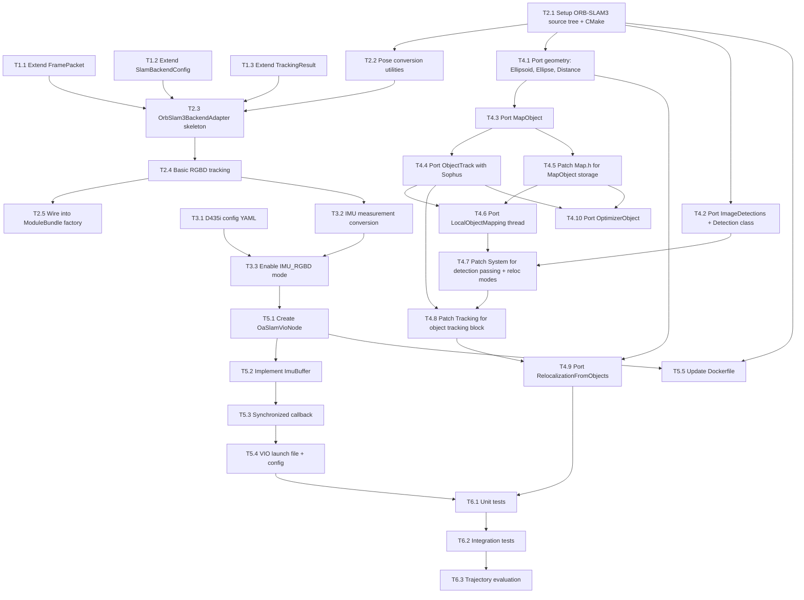

# ORB-SLAM3 Migration — Subtask Breakdown

Reference: [`plans/orbslam3-migration-plan.md`](plans/orbslam3-migration-plan.md)

---

## Subtask Dependency Graph



---

## Phase 1: Foundation — Core Type Extensions

### T1.1: Extend FramePacket with IMU Data

**File**: [`include/oaslam/core/frame_packet.h`](include/oaslam/core/frame_packet.h)
**Dependencies**: None
**Description**: Add `ImuMeasurement` struct and IMU fields to `FramePacket`. Backward-compatible — existing code ignores new fields.

**Deliverables**:
- `ImuMeasurement` struct: `timestamp`, `acc_x/y/z`, `gyro_x/y/z`
- `std::vector<ImuMeasurement> imu_measurements` field on `FramePacket`
- `bool has_imu = false` field on `FramePacket`

**Validation**: Full project compiles unchanged; ORB-SLAM2 adapter still works.

---

### T1.2: Extend SlamBackendConfig

**File**: [`include/oaslam/core/session_types.h`](include/oaslam/core/session_types.h)
**Dependencies**: None
**Description**: Add `SlamBackendKind` enum and `use_imu` flag to `SlamBackendConfig`.

**Deliverables**:
- `enum class SlamBackendKind { OrbSlam2, OrbSlam3 }`
- `SlamBackendKind kind = SlamBackendKind::OrbSlam2` field
- `bool use_imu = false` field

**Validation**: Full project compiles unchanged; default kind is OrbSlam2.

---

### T1.3: Extend TrackingResult

**File**: [`include/oaslam/core/tracking_types.h`](include/oaslam/core/tracking_types.h)
**Dependencies**: None
**Description**: Add IMU state fields to `TrackingResult`.

**Deliverables**:
- `bool imu_initialized = false`
- `double velocity_x = 0.0, velocity_y = 0.0, velocity_z = 0.0`

**Validation**: Full project compiles unchanged.

---

## Phase 2: ORB-SLAM3 Vanilla Integration

### T2.1: Setup ORB-SLAM3 Source Tree and CMake

**Files**: `src/adapters/orbslam3/internal/`, `CMakeLists.txt`
**Dependencies**: None (can start in parallel with Phase 1)
**Description**: Clone ORB-SLAM3 source, organize into `internal/` directory, integrate with CMake build. ORB-SLAM3 bundles its own g2o and Sophus.

**Deliverables**:
- ORB-SLAM3 source in `src/adapters/orbslam3/internal/include/` and `src/adapters/orbslam3/internal/src/`
- ORB-SLAM3 Thirdparty (Sophus, g2o) in `src/adapters/orbslam3/internal/Thirdparty/`
- CMakeLists.txt additions with `USE_ORBSLAM3` option
- Compiles as part of project

**Validation**: `cmake --build build` succeeds with ORB-SLAM3 sources.

---

### T2.2: Create Pose Conversion Utilities

**Files**: `src/adapters/orbslam3/orbslam3_pose_utils.h`, `src/adapters/orbslam3/orbslam3_pose_utils.cc`
**Dependencies**: T2.1
**Description**: Implement `Sophus::SE3f` ↔ `Transform4d` conversions, `Eigen::Vector3f` → `cv::Point3d`, and `ImuMeasurement` → `ORB_SLAM3::IMU::Point`.

**Deliverables**:
- `SophusTcwToTransform4d()` — inverts Tcw to Twc, converts to `cv::Matx44d`
- `EigenToPoint3d()` — `Eigen::Vector3f` → `cv::Point3d`
- `ToImuPoint()` — `ImuMeasurement` → `ORB_SLAM3::IMU::Point`

**Validation**: Roundtrip conversion test with error < 1e-6.

---

### T2.3: Create OrbSlam3BackendAdapter Skeleton

**Files**: `src/adapters/orbslam3/orbslam3_backend_adapter.h`, `src/adapters/orbslam3/orbslam3_backend_adapter.cc`
**Dependencies**: T1.1, T1.2, T1.3, T2.2
**Description**: Implement `ISlamBackend` interface with constructor, destructor, `ensureRuntime()`, `toLegacyDetections()`, `mapTrackingState()`. `processFrame()` is a stub that returns empty result.

**Deliverables**:
- Class declaration implementing `ISlamBackend`
- Constructor creates `ORB_SLAM3::System` in RGBD or IMU_RGBD mode
- `mapTrackingState()` maps ORB-SLAM3 states to `TrackingState` enum
- `shouldQuit()` method

**Validation**: Compiles and links.

---

### T2.4: Implement Basic RGBD Tracking

**Files**: `src/adapters/orbslam3/orbslam3_backend_adapter.cc`
**Dependencies**: T2.3
**Description**: Implement `processFrame()` for RGBD mode without IMU or object detections. Calls `System::TrackRGBD()`, converts Sophus pose to `Transform4d`, extracts tracked map points.

**Deliverables**:
- `processFrame()` calls `TrackRGBD(image, depth, timestamp, {}, "")`
- Pose extraction via `SophusTcwToTransform4d()`
- Map point extraction via `GetTrackedMapPoints()` with `Eigen::Vector3f` → `cv::Point3d`
- `reset()` calls `System::Reset()`
- `shutdown()` calls `System::Shutdown()`

**Validation**: Produces valid poses on an RGBD sequence.

---

### T2.5: Wire into ModuleBundle Factory

**Files**: [`src/app/module_factories.cc`](src/app/module_factories.cc)
**Dependencies**: T2.4
**Description**: Add `SlamBackendKind::OrbSlam3` branch in `CreateDefaultModules()`.

**Deliverables**:
- Switch on `config.slam_backend.kind`
- Create `OrbSlam3BackendAdapter` when kind is `OrbSlam3`
- Wire `shouldQuit()` to visualizer

**Validation**: `SlamSession` creates and uses ORB-SLAM3 backend when configured.

---

## Phase 3: IMU Integration

### T3.1: Create D435i Configuration YAML

**Files**: `ros2/oaslam_ros2_wrapper/config/d435i_imu_rgbd.yaml`
**Dependencies**: None (can be done in parallel)
**Description**: Create ORB-SLAM3 format YAML with Camera1 pinhole model, BMI055 IMU noise parameters, IMU-to-camera extrinsic matrix, ORB extractor parameters.

**Deliverables**:
- `Camera1.*` intrinsics for D435i (fx=605.64, fy=605.62, cx=325.03, cy=237.23)
- `IMU.NoiseGyro`, `IMU.NoiseAcc`, `IMU.GyroWalk`, `IMU.AccWalk`, `IMU.Frequency`
- `IMU.T_b_c1` extrinsic matrix
- `RGBD.DepthMapFactor: 1000.0`

**Validation**: ORB-SLAM3 `Settings` class parses without errors.

---

### T3.2: Implement IMU Measurement Conversion

**Files**: `src/adapters/orbslam3/orbslam3_backend_adapter.cc`
**Dependencies**: T2.4
**Description**: Implement `toImuPoints()` method converting `vector<ImuMeasurement>` to `vector<ORB_SLAM3::IMU::Point>`.

**Deliverables**:
- `toImuPoints()` method
- Handles empty vector gracefully

**Validation**: Unit test verifies exact value match for acc/gyro/timestamp.

---

### T3.3: Enable IMU_RGBD Mode

**Files**: `src/adapters/orbslam3/orbslam3_backend_adapter.cc`
**Dependencies**: T3.1, T3.2
**Description**: Modify `ensureRuntime()` to create System with `IMU_RGBD` sensor when `config_.use_imu` is true. Modify `processFrame()` to pass IMU measurements to `TrackRGBD()`.

**Deliverables**:
- Sensor mode selection: `IMU_RGBD` when `use_imu`, else `RGBD`
- IMU vector passed to `TrackRGBD()`
- `imu_initialized` field populated in `TrackingResult`

**Validation**: VIO initializes on D435i sequence; IMU preintegration converges within 15s.

---

## Phase 4: OA-SLAM Patch Porting

### T4.1: Port Geometry Utilities

**Source files**: [`Ellipsoid.h/cc`](src/adapters/orbslam2/internal/include/Ellipsoid.h), [`Ellipse.h/cc`](src/adapters/orbslam2/internal/include/Ellipse.h), [`Distance.h/cc`](src/adapters/orbslam2/internal/include/Distance.h), [`RingBuffer.h`](src/adapters/orbslam2/internal/include/RingBuffer.h), [`ColorManager.h/cc`](src/adapters/orbslam2/internal/include/ColorManager.h), [`Utils.h/cc`](src/adapters/orbslam2/internal/include/Utils.h)
**Target**: `src/adapters/orbslam3/internal/include/` and `src/adapters/orbslam3/internal/src/`
**Dependencies**: T2.1
**Description**: Copy from ORB-SLAM2 adapter, rename namespace `ORB_SLAM2` → `ORB_SLAM3`. These files use only Eigen internally and need minimal changes.

**Deliverables**: All geometry utilities compile under `ORB_SLAM3` namespace.

---

### T4.2: Port ImageDetections and Detection Class

**Source**: [`ImageDetections.h/cc`](src/adapters/orbslam2/internal/include/ImageDetections.h)
**Target**: `src/adapters/orbslam3/internal/include/ImageDetections.h`
**Dependencies**: T2.1
**Description**: Copy Detection class, rename namespace. The `Detection` class is used by the adapter to pass detections into the SLAM tracker.

**Deliverables**: `ORB_SLAM3::Detection` class with `category_id`, `score`, `bbox` fields.

---

### T4.3: Port MapObject

**Source**: [`MapObject.h/cc`](src/adapters/orbslam2/internal/include/MapObject.h)
**Target**: `src/adapters/orbslam3/internal/include/MapObject.h`
**Dependencies**: T4.1, T2.1
**Description**: Port MapObject wrapping Ellipsoid + ObjectTrack pointer. Minor changes: namespace rename, ensure `KeyFrame` forward declaration matches ORB-SLAM3.

**Deliverables**: `ORB_SLAM3::MapObject` class with `GetEllipsoid()`, `SetEllipsoid()`, `GetTrack()`, `Merge()`, `RemoveKeyFrameObservation()`.

---

### T4.4: Port ObjectTrack with Sophus Adaptations

**Source**: [`ObjectTrack.h/cc`](src/adapters/orbslam2/internal/include/ObjectTrack.h)
**Target**: `src/adapters/orbslam3/internal/include/ObjectTrack.h`
**Dependencies**: T4.1, T4.3, T2.2
**Description**: This is the most complex porting task. ObjectTrack stores poses as `Matrix34d` (Eigen) which is compatible, but accesses `MapPoint::GetWorldPos()` which changes from `cv::Mat` to `Eigen::Vector3f` in ORB-SLAM3.

**Key changes**:
- `MapPoint::GetWorldPos()` returns `Eigen::Vector3f` instead of `cv::Mat`
- `Tracking*` pointer type changes to ORB-SLAM3 Tracking
- `Map*` pointer from Atlas
- g2o types may differ between ORB-SLAM2 and ORB-SLAM3 bundled versions

**Deliverables**: Full ObjectTrack lifecycle: ONLY_2D → INITIALIZED → IN_MAP → BAD. All reconstruction methods working.

---

### T4.5: Patch ORB-SLAM3 Map.h for MapObject Storage

**Files**: `src/adapters/orbslam3/internal/include/Map.h`, `src/adapters/orbslam3/internal/src/Map.cc`
**Dependencies**: T4.3
**Description**: Add `MapObject` storage to ORB-SLAM3 `Map` class, same pattern as current OA-SLAM patches on ORB-SLAM2.

**Deliverables**:
- `std::set<MapObject*> map_objects_` member
- `AddMapObject()`, `EraseMapObject()`, `GetAllMapObjects()`, `GetNumberMapObjects()` methods

---

### T4.6: Port LocalObjectMapping Thread

**Source**: [`LocalObjectMapping.h/cc`](src/adapters/orbslam2/internal/include/LocalObjectMapping.h)
**Target**: `src/adapters/orbslam3/internal/include/LocalObjectMapping.h`
**Dependencies**: T4.4, T4.5
**Description**: Port the separate thread for object optimization and fusion. Must be Atlas-aware — use `Atlas::GetCurrentMap()` instead of direct `Map*`.

**Deliverables**: Thread starts, processes modified objects, runs optimization.

---

### T4.7: Patch ORB-SLAM3 System for Detection Passing and Reloc Modes

**Files**: `src/adapters/orbslam3/internal/include/System.h`, `src/adapters/orbslam3/internal/src/System.cc`
**Dependencies**: T4.2, T4.6
**Description**: Add `enumRelocalizationMode`, extend `TrackRGBD()` signature with `Detection::Ptr` vector, add `LocalObjectMapping` thread lifecycle, add `relocalization_duration`/`relocalization_status` fields.

**Deliverables**:
- `enumRelocalizationMode` enum (RELOC_POINTS, RELOC_OBJECTS, RELOC_OBJECTS_POINTS)
- `SetRelocalizationMode()` / `GetRelocalizationMode()`
- `TrackRGBD()` accepts detections
- `LocalObjectMapping*` thread member and lifecycle management

---

### T4.8: Patch ORB-SLAM3 Tracking for Object Tracking Block

**Files**: `src/adapters/orbslam3/internal/include/Tracking.h`, `src/adapters/orbslam3/internal/src/Tracking.cc`
**Dependencies**: T4.4, T4.7
**Description**: Port the object tracking block (lines 360-626 from ORB-SLAM2 Tracking.cc) into ORB-SLAM3's `GrabImageRGBD()`. This is the largest single porting task.

**Key adaptations**:
- Replace `cvToEigenMatrix<double, float, 3, 4>(mCurrentFrame.mTcw)` with `mCurrentFrame.GetPose().matrix3x4().cast<double>()`
- Replace `MapPoint::GetWorldPos()` cv::Mat access with `Eigen::Vector3f`
- Replace `mpMap->` with `mpAtlas->GetCurrentMap()->` for object operations
- Add `objectTracks_`, `current_frame_idx_`, `current_frame_detections_`, `current_frame_good_detections_`, `current_mean_depth_` members
- Add relocalization mode dispatch in `Track()` method

**Deliverables**: Objects tracked across frames, Hungarian algorithm matching works, objects inserted into map.

---

### T4.9: Port RelocalizationFromObjects

**Source**: [`Tracking.cc:1759-1847`](src/adapters/orbslam2/internal/src/Tracking.cc:1759), [`Localization.h/cc`](src/adapters/orbslam2/internal/include/Localization.h)
**Target**: `src/adapters/orbslam3/internal/src/Tracking.cc`, `src/adapters/orbslam3/internal/include/Localization.h`
**Dependencies**: T4.1, T4.8
**Description**: Port object-based relocalization. The P3P RANSAC in `Localization.cc` is pure Eigen and needs only namespace rename. The `RelocalizationFromObjects()` in Tracking.cc needs Sophus pose handling.

**Key adaptation**: Replace `cv::Mat Rt` pose construction with `Sophus::SE3f` construction from Eigen rotation + translation.

**Deliverables**: Relocalization succeeds using ellipsoid-to-bbox correspondences.

---

### T4.10: Port OptimizerObject

**Source**: [`OptimizerObject.h/cc`](src/adapters/orbslam2/internal/include/OptimizerObject.h)
**Target**: `src/adapters/orbslam3/internal/include/OptimizerObject.h`
**Dependencies**: T4.4, T4.5
**Description**: Adapt object-aware bundle adjustment to ORB-SLAM3's bundled g2o version. The g2o API may differ slightly between versions.

**Deliverables**: Object-aware BA runs, improves ellipsoid reconstruction quality.

---

## Phase 5: ROS2 VIO Node

### T5.1: Create OaSlamVioNode with Subscriptions

**Files**: `ros2/oaslam_ros2_wrapper/src/oaslam_vio_node.cpp`
**Dependencies**: T3.3
**Description**: Create new ROS2 node with RGB + Depth + IMU subscriptions using `message_filters::ApproximateTimeSynchronizer` for image sync and direct IMU callback.

**Deliverables**:
- Node class with parameter declarations
- `message_filters::Subscriber` for RGB and Depth
- `ApproximateTimeSynchronizer` for image pair sync
- Direct `rclcpp::Subscription` for IMU
- Pose publisher

---

### T5.2: Implement ImuBuffer

**Files**: `ros2/oaslam_ros2_wrapper/src/oaslam_vio_node.cpp`
**Dependencies**: T5.1
**Description**: Thread-safe IMU ring buffer with `push()` and `drainUpTo(timestamp)` methods.

**Deliverables**: `ImuBuffer` class with mutex-protected deque.

---

### T5.3: Implement Synchronized Callback

**Files**: `ros2/oaslam_ros2_wrapper/src/oaslam_vio_node.cpp`
**Dependencies**: T5.2
**Description**: `HandleSyncedImages()` builds `FramePacket` with RGB + Depth + drained IMU, calls `session_->processFrame()`, publishes pose.

**Deliverables**: End-to-end data flow from ROS2 topics to SLAM to pose output.

---

### T5.4: Create VIO Launch File and Config

**Files**: `ros2/oaslam_ros2_wrapper/launch/oaslam_vio.launch.py`, `ros2/oaslam_ros2_wrapper/config/wrapper_vio.yaml`
**Dependencies**: T5.3
**Description**: Launch file and parameter config for VIO mode with D435i topics.

**Deliverables**: `ros2 launch oaslam_ros2_wrapper oaslam_vio.launch.py` works.

---

### T5.5: Update Dockerfile

**Files**: [`docker/Dockerfile`](docker/Dockerfile)
**Dependencies**: T2.1, T5.1
**Description**: Add Sophus installation, `ros-humble-message-filters` package, update `package.xml` with new dependencies.

**Deliverables**: Docker image builds with all new dependencies.

---

## Phase 6: Validation

### T6.1: Unit Tests

**Dependencies**: All Phase 1-5 tasks
**Description**: Pose conversion roundtrip, IMU conversion, detection conversion, config parsing, backward compatibility.

### T6.2: Integration Tests

**Dependencies**: T6.1
**Description**: RGBD-only tracking, VIO tracking, object detection passthrough, object relocalization, semantic map persistence.

### T6.3: Trajectory Evaluation

**Dependencies**: T6.2
**Description**: evo toolkit ATE/RPE comparison, ORB-SLAM2 vs ORB-SLAM3 trajectory comparison, performance benchmarks.

---

## Parallel Execution Groups

| Group | Tasks | Can Run In Parallel With |
|-------|-------|-------------------------|
| **A** | T1.1, T1.2, T1.3 | B |
| **B** | T2.1, T3.1 | A |
| **C** | T2.2 → T2.3 → T2.4 → T2.5 | E (after T2.1 done) |
| **D** | T3.2 → T3.3 | E, F |
| **E** | T4.1, T4.2 | C, D |
| **F** | T4.3 → T4.4, T4.5 → T4.6 | D |
| **G** | T4.7 → T4.8 → T4.9, T4.10 | H (partially) |
| **H** | T5.1 → T5.2 → T5.3 → T5.4, T5.5 | G (partially) |
| **I** | T6.1 → T6.2 → T6.3 | — |

## Critical Path

```
T2.1 → T2.2 → T2.3 → T2.4 → T2.5 → T3.2 → T3.3 → T5.1 → T5.2 → T5.3 → T6.2
```
