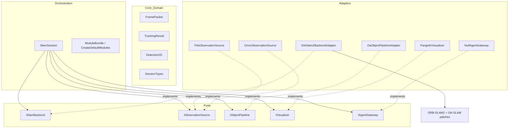
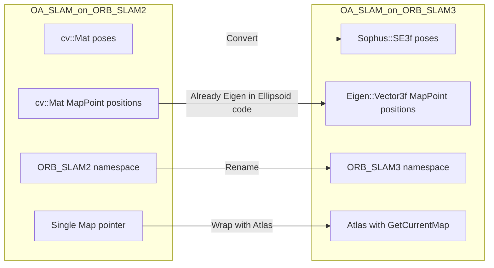
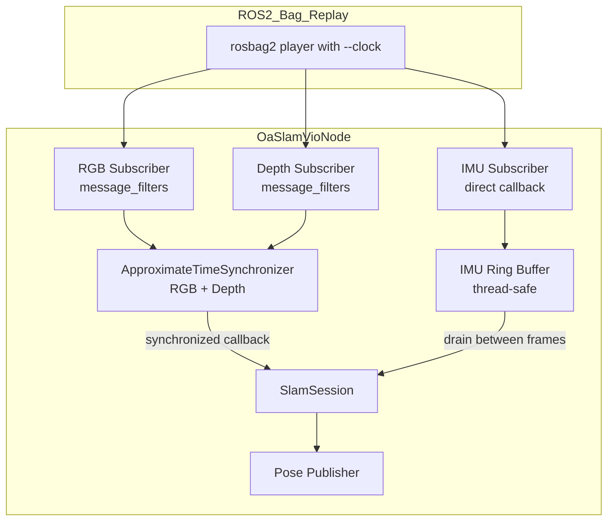
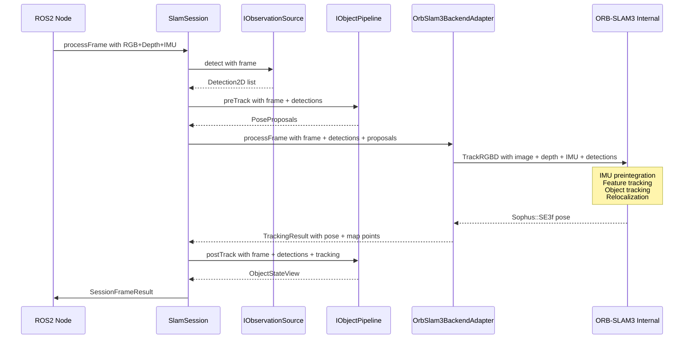

# ORB-SLAM2 → ORB-SLAM3 Migration Plan: Visual-Inertial RGBD with D435i

## 1. Executive Summary

This plan details the replacement of the ORB-SLAM2 core with ORB-SLAM3 inside the existing OA-SLAM modular pipeline, enabling Visual-Inertial Odometry (VIO) using an Intel RealSense D435i camera. The existing architecture already follows a clean hexagonal/ports-and-adapters pattern with well-defined interfaces. The migration preserves all OA-SLAM semantic features (object-based relocalization, ellipsoid mapping, object tracking) while adding IMU fusion capabilities.

---

## 2. Existing Architecture Analysis

### 2.1 Hexagonal Architecture Overview



### 2.2 Key Interface: ISlamBackend

Defined in [`ISlamBackend`](include/oaslam/ports/slam_backend.h:13):

```cpp
class ISlamBackend {
 public:
  virtual ~ISlamBackend() = default;
  virtual TrackingResult processFrame(
      const FramePacket& frame,
      const std::vector<Detection2D>& detections,
      const std::vector<PoseProposal>& pose_proposals) = 0;
  virtual void reset() = 0;
  virtual void shutdown() = 0;
};
```

### 2.3 Key Data Types

| Type | File | Purpose |
|------|------|---------|
| [`FramePacket`](include/oaslam/core/frame_packet.h:11) | frame_packet.h | Image + depth + timestamp + camera_id |
| [`TrackingResult`](include/oaslam/core/tracking_types.h:28) | tracking_types.h | Pose, state, scene slice with features/map points |
| [`Detection2D`](include/oaslam/core/object_types.h:14) | object_types.h | Category, score, bbox |
| [`TrackingState`](include/oaslam/core/session_types.h:9) | session_types.h | Bootstrapping, Tracking, Relocalizing, Lost |
| [`SlamBackendConfig`](include/oaslam/core/session_types.h:13) | session_types.h | Vocabulary, camera settings, relocalization mode |

### 2.4 Session Orchestration Flow

The [`SlamSession::processFrame()`](src/app/slam_session.cc:10) orchestrates the pipeline:

1. `agent_gateway->pollRemoteDeltas()`
2. `observation_source->detect(frame)` → detections
3. `object_pipeline->preTrack(frame, detections)` → pose proposals
4. **`slam_backend->processFrame(frame, detections, pose_proposals)`** → tracking result
5. `object_pipeline->postTrack(frame, detections, tracking)` → object state
6. `visualizer->publish(frame, tracking, objects)`
7. `agent_gateway->publishLocalDelta()`

### 2.5 OA-SLAM Patches Inventory - Must Preserve

These are the semantic/object-aware modifications to ORB-SLAM2 that must be ported to ORB-SLAM3:

| Feature | Files | Description |
|---------|-------|-------------|
| **Object-based Relocalization** | [`Tracking.cc:1759-1847`](src/adapters/orbslam2/internal/src/Tracking.cc:1759) | `RelocalizationFromObjects()` - P3P RANSAC using ellipsoid-to-bbox correspondences |
| **Relocalization Mode Selection** | [`Tracking.cc:709-720`](src/adapters/orbslam2/internal/src/Tracking.cc:709), [`System.h:74-78`](src/adapters/orbslam2/internal/include/System.h:74) | `enumRelocalizationMode` with Points, Objects, PointsAndObjects |
| **Object Tracking in Frames** | [`Tracking.cc:360-626`](src/adapters/orbslam2/internal/src/Tracking.cc:360) | Hungarian algorithm matching detections to object tracks using 2D IoU, 3D projected IoU, and map point associations |
| **Object Track Lifecycle** | [`ObjectTrack.h`](src/adapters/orbslam2/internal/include/ObjectTrack.h:66) | ONLY_2D → INITIALIZED → IN_MAP → BAD state machine |
| **Ellipsoid Reconstruction** | [`ObjectTrack.h:74-78`](src/adapters/orbslam2/internal/include/ObjectTrack.h:74) | Multiple reconstruction methods: center, landmarks, samples |
| **Map Objects Storage** | [`Map.h:76-83`](src/adapters/orbslam2/internal/include/Map.h:76) | `AddMapObject()`, `EraseMapObject()`, `GetAllMapObjects()` |
| **MapObject with Ellipsoid** | [`MapObject.h`](src/adapters/orbslam2/internal/include/MapObject.h:44) | Wraps Ellipsoid + ObjectTrack pointer |
| **Local Object Mapping Thread** | [`LocalObjectMapping.h`](src/adapters/orbslam2/internal/include/LocalObjectMapping.h:43) | Separate thread for object optimization and fusion |
| **Object-aware Localization** | [`Localization.h`](src/adapters/orbslam2/internal/include/Localization.h:35) | `solveP3P_ransac()`, `OptimizePoseFromObjects()` |
| **Detection Passing to Tracker** | [`System.cc:257-324`](src/adapters/orbslam2/internal/src/System.cc:257) | `TrackMonocular()` accepts `Detection::Ptr` vector |
| **Object-aware Optimizer** | [`OptimizerObject.h`](src/adapters/orbslam2/internal/include/OptimizerObject.h) | Object-aware bundle adjustment extensions |

---

## 3. ORB-SLAM2 vs ORB-SLAM3 API Differences

### 3.1 System Initialization

| Aspect | ORB-SLAM2 | ORB-SLAM3 |
|--------|-----------|-----------|
| **Namespace** | `ORB_SLAM2` | `ORB_SLAM3` |
| **Sensor enum** | `MONOCULAR`, `STEREO`, `RGBD` | `MONOCULAR`, `STEREO`, `RGBD`, `IMU_MONOCULAR`, `IMU_STEREO`, `IMU_RGBD` |
| **Constructor** | `System(voc, settings, sensor, useViewer)` | `System(voc, settings, sensor, useViewer, initFr, strSequence)` |
| **Settings format** | YAML with flat `Camera.fx` etc. | YAML with `Camera1.*` sections, `IMU.*` section |
| **Vocabulary** | Text-based ORBvoc.txt | Binary ORBvoc.txt or .bin |

### 3.2 Frame Processing

| Aspect | ORB-SLAM2 | ORB-SLAM3 |
|--------|-----------|-----------|
| **Monocular** | `TrackMonocular(im, timestamp)` | `TrackMonocular(im, timestamp, vImuMeas, filename)` |
| **RGBD** | `TrackRGBD(im, depth, timestamp)` | `TrackRGBD(im, depth, timestamp, vImuMeas, filename)` |
| **Stereo** | `TrackStereo(imL, imR, timestamp)` | `TrackStereo(imL, imR, timestamp, vImuMeas, filename)` |
| **IMU input** | N/A | `vector<ORB_SLAM3::IMU::Point>` with acc, gyro, timestamp |
| **Return type** | `cv::Mat` 4x4 Tcw | `Sophus::SE3f` Tcw |

### 3.3 Pose Representation

| Aspect | ORB-SLAM2 | ORB-SLAM3 |
|--------|-----------|-----------|
| **Pose type** | `cv::Mat` 4x4 float | `Sophus::SE3f` |
| **MapPoint position** | `cv::Mat` 3x1 float | `Eigen::Vector3f` |
| **Rotation** | `cv::Mat` 3x3 | `Sophus::SO3f` / `Eigen::Matrix3f` |
| **Translation** | `cv::Mat` 3x1 | `Eigen::Vector3f` |

### 3.4 Map and KeyFrame Access

| Aspect | ORB-SLAM2 | ORB-SLAM3 |
|--------|-----------|-----------|
| **Map access** | Single `Map*` | `Atlas` with multiple maps, `GetCurrentMap()` |
| **MapPoint::GetWorldPos** | Returns `cv::Mat` | Returns `Eigen::Vector3f` |
| **KeyFrame pose** | `cv::Mat GetPose()` | `Sophus::SE3f GetPose()` |
| **Tracked points** | `GetTrackedMapPoints()` returns `vector<MapPoint*>` | Same signature, MapPoint internals differ |
| **Tracking state** | `Tracking::eTrackingState` enum | Similar but with additional IMU states |

### 3.5 IMU-Specific Additions in ORB-SLAM3

```cpp
// ORB-SLAM3 IMU measurement structure
namespace ORB_SLAM3 {
namespace IMU {
  class Point {
  public:
    Point(float ax, float ay, float az,
          float wx, float wy, float wz,
          double t);
    Eigen::Vector3f a;  // accelerometer (m/s^2)
    Eigen::Vector3f w;  // gyroscope (rad/s)
    double t;           // timestamp (seconds)
  };
}}
```

---

## 4. Interface Layer Evolution

### 4.1 Extended FramePacket with IMU Data

The existing [`FramePacket`](include/oaslam/core/frame_packet.h:11) must be extended to carry IMU measurements:

```cpp
// include/oaslam/core/frame_packet.h

struct ImuMeasurement {
  double timestamp = 0.0;
  double acc_x = 0.0, acc_y = 0.0, acc_z = 0.0;   // m/s^2
  double gyro_x = 0.0, gyro_y = 0.0, gyro_z = 0.0; // rad/s
};

struct FramePacket {
  uint64_t frame_id = 0;
  double timestamp = 0.0;
  std::string camera_id = "mono0";
  cv::Mat image;
  cv::Mat right_image;
  cv::Mat depth_image;
  bool has_right = false;
  bool has_depth = false;

  // NEW: IMU measurements between previous frame and this frame
  std::vector<ImuMeasurement> imu_measurements;
  bool has_imu = false;
};
```

**Rationale**: The `ISlamBackend::processFrame()` signature remains unchanged because `FramePacket` is passed by const reference. Backends that do not use IMU simply ignore the new fields. This is fully backward-compatible.

### 4.2 Extended SlamBackendConfig

```cpp
// include/oaslam/core/session_types.h

enum class SlamBackendKind { OrbSlam2, OrbSlam3 };

struct SlamBackendConfig {
  SlamBackendKind kind = SlamBackendKind::OrbSlam2;
  std::string vocabulary_file;
  std::string camera_settings_file;
  bool use_viewer = true;
  bool use_ar_viewer = false;
  int use_objects_in_local_ba = 0;
  RelocalizationMode relocalization_mode = RelocalizationMode::Points;

  // NEW: ORB-SLAM3 specific
  bool use_imu = false;
};
```

### 4.3 ISlamBackend - No Change Required

The existing [`ISlamBackend`](include/oaslam/ports/slam_backend.h:13) interface does NOT need to change. The `processFrame()` method already receives `FramePacket` which will carry IMU data. The adapter implementation decides how to use it.

### 4.4 TrackingResult - Minor Extension

```cpp
// include/oaslam/core/tracking_types.h - additions

struct TrackingResult {
  TrackingState state = TrackingState::Bootstrapping;
  bool has_pose = false;
  Transform4d T_world_camera = Transform4d::eye();
  SceneSlice scene;
  double relocalization_duration_ms = -1.0;
  bool relocalization_success = false;

  // NEW: IMU-related state
  bool imu_initialized = false;
  double velocity_x = 0.0, velocity_y = 0.0, velocity_z = 0.0;
};
```

---

## 5. ORB-SLAM3 Adapter Architecture

### 5.1 Directory Structure

```
src/adapters/orbslam3/
├── orbslam3_backend_adapter.h
├── orbslam3_backend_adapter.cc
├── orbslam3_pose_utils.h          # Sophus::SE3f <-> Transform4d conversions
├── orbslam3_pose_utils.cc
└── internal/                       # ORB-SLAM3 source with OA-SLAM patches
    ├── include/
    │   ├── System.h                # Patched: detection passing, reloc modes
    │   ├── Tracking.h              # Patched: object tracking, reloc from objects
    │   ├── Atlas.h                 # Stock ORB-SLAM3
    │   ├── Map.h                   # Patched: MapObject storage
    │   ├── MapPoint.h              # Stock ORB-SLAM3
    │   ├── KeyFrame.h              # Stock ORB-SLAM3
    │   ├── Frame.h                 # Stock ORB-SLAM3
    │   ├── ImuTypes.h              # Stock ORB-SLAM3
    │   ├── ... other ORB-SLAM3 headers ...
    │   ├── MapObject.h             # Ported from OA-SLAM, adapted for Eigen types
    │   ├── ObjectTrack.h           # Ported from OA-SLAM
    │   ├── Localization.h          # Ported from OA-SLAM
    │   ├── LocalObjectMapping.h    # Ported from OA-SLAM
    │   ├── Ellipsoid.h             # Ported from OA-SLAM, unchanged
    │   ├── Ellipse.h               # Ported from OA-SLAM, unchanged
    │   └── ImageDetections.h       # Ported from OA-SLAM
    └── src/
        ├── System.cc               # Patched
        ├── Tracking.cc             # Patched
        ├── ... other ORB-SLAM3 sources ...
        ├── MapObject.cc            # Ported
        ├── ObjectTrack.cc          # Ported
        ├── Localization.cc         # Ported
        └── LocalObjectMapping.cc   # Ported
```

### 5.2 OrbSlam3BackendAdapter Class

```cpp
// src/adapters/orbslam3/orbslam3_backend_adapter.h

#ifndef OASLAM_ADAPTERS_ORBSLAM3_ORBSLAM3_BACKEND_ADAPTER_H
#define OASLAM_ADAPTERS_ORBSLAM3_ORBSLAM3_BACKEND_ADAPTER_H

#include <memory>
#include <vector>

#include "oaslam/core/session_types.h"
#include "oaslam/ports/slam_backend.h"

namespace ORB_SLAM3 {
class System;
class Detection;
namespace IMU { class Point; }
}

namespace oaslam {

class OrbSlam3BackendAdapter : public ISlamBackend {
 public:
  explicit OrbSlam3BackendAdapter(const SlamBackendConfig& config);
  ~OrbSlam3BackendAdapter() override;

  TrackingResult processFrame(
      const FramePacket& frame,
      const std::vector<Detection2D>& detections,
      const std::vector<PoseProposal>& pose_proposals) override;
  void reset() override;
  void shutdown() override;

  bool shouldQuit() const;

 private:
  void ensureRuntime() const;

  std::vector<std::shared_ptr<ORB_SLAM3::Detection>> toLegacyDetections(
      const std::vector<Detection2D>& detections) const;
  std::vector<ORB_SLAM3::IMU::Point> toImuPoints(
      const std::vector<ImuMeasurement>& measurements) const;
  TrackingState mapTrackingState(int legacy_state) const;

  SlamBackendConfig config_;
  mutable std::unique_ptr<ORB_SLAM3::System> system_;
  mutable bool is_shutdown_ = false;
};

}  // namespace oaslam

#endif
```

### 5.3 Adapter Implementation - Key processFrame Method

```cpp
TrackingResult OrbSlam3BackendAdapter::processFrame(
    const FramePacket& frame,
    const std::vector<Detection2D>& detections,
    const std::vector<PoseProposal>& pose_proposals) {
  (void)pose_proposals;

  ensureRuntime();
  const auto legacy_detections = toLegacyDetections(detections);

  // Convert IMU measurements to ORB-SLAM3 format
  std::vector<ORB_SLAM3::IMU::Point> imu_points;
  if (frame.has_imu) {
    imu_points = toImuPoints(frame.imu_measurements);
  }

  // Call appropriate tracking method based on available data
  Sophus::SE3f Tcw;
  if (frame.has_depth) {
    // IMU_RGBD or RGBD mode
    Tcw = system_->TrackRGBD(
        frame.image, frame.depth_image, frame.timestamp,
        imu_points, legacy_detections, false);
  } else {
    // IMU_MONOCULAR or MONOCULAR fallback
    Tcw = system_->TrackMonocular(
        frame.image, frame.timestamp,
        imu_points, legacy_detections, false);
  }

  // Build result
  TrackingResult result;
  result.relocalization_duration_ms = system_->relocalization_duration;
  result.relocalization_success = system_->relocalization_status;
  result.state = mapTrackingState(system_->GetTrackingState());

  if (!Tcw.matrix().isZero(0)) {
    result.has_pose = true;
    result.T_world_camera = SophusTcwToTransform4d(Tcw);
    result.scene.has_pose = true;
    result.scene.T_world_camera = result.T_world_camera;
  }

  // Extract tracked map points
  const auto tracked_points = system_->GetTrackedMapPoints();
  const auto tracked_keypoints = system_->GetTrackedKeyPointsUn();
  const std::size_t count = std::min(tracked_points.size(), tracked_keypoints.size());
  result.scene.tracked_features.reserve(count);
  result.scene.visible_map_points.reserve(count);

  for (std::size_t i = 0; i < count; ++i) {
    ORB_SLAM3::MapPoint* mp = tracked_points[i];
    if (!mp) continue;

    // ORB-SLAM3 returns Eigen::Vector3f
    Eigen::Vector3f pos = mp->GetWorldPos();
    cv::Point3d world_point(pos.x(), pos.y(), pos.z());
    result.scene.visible_map_points.push_back(world_point);
    result.scene.tracked_features.push_back(
        TrackedFeature{tracked_keypoints[i], world_point, true});
  }

  return result;
}
```

### 5.4 Pose Conversion Utilities

```cpp
// src/adapters/orbslam3/orbslam3_pose_utils.h

#include <Eigen/Dense>
#include <sophus/se3.hpp>
#include "oaslam/core/geometry_types.h"

namespace oaslam {

// Sophus::SE3f Tcw -> Transform4d Twc (world-to-camera inverted)
inline Transform4d SophusTcwToTransform4d(const Sophus::SE3f& Tcw) {
  Sophus::SE3f Twc = Tcw.inverse();
  Eigen::Matrix4f mat = Twc.matrix();
  Transform4d result;
  for (int r = 0; r < 4; ++r)
    for (int c = 0; c < 4; ++c)
      result(r, c) = static_cast<double>(mat(r, c));
  return result;
}

// Eigen::Vector3f from ORB-SLAM3 MapPoint -> cv::Point3d
inline cv::Point3d EigenToPoint3d(const Eigen::Vector3f& v) {
  return cv::Point3d(v.x(), v.y(), v.z());
}

// IMU measurement conversion
inline ORB_SLAM3::IMU::Point ToImuPoint(const ImuMeasurement& m) {
  return ORB_SLAM3::IMU::Point(
      static_cast<float>(m.acc_x), static_cast<float>(m.acc_y),
      static_cast<float>(m.acc_z), static_cast<float>(m.gyro_x),
      static_cast<float>(m.gyro_y), static_cast<float>(m.gyro_z),
      m.timestamp);
}

}  // namespace oaslam
```

### 5.5 Module Factory Extension

```cpp
// src/app/module_factories.cc - updated

ModuleBundle CreateDefaultModules(const SessionConfig& config) {
  ModuleBundle bundle;

  if (config.slam_backend.kind == SlamBackendKind::OrbSlam3) {
    auto backend = std::make_unique<OrbSlam3BackendAdapter>(config.slam_backend);
    auto* backend_ptr = backend.get();
    bundle.slam_backend = std::move(backend);

    // Visualizer uses shouldQuit from ORB-SLAM3 adapter
    if (config.visualizer.enabled) {
      bundle.visualizer = std::make_unique<PangolinVisualizer>(
          [backend_ptr]() { return backend_ptr->shouldQuit(); });
    }
  } else {
    // Existing ORB-SLAM2 path (unchanged)
    auto backend = std::make_unique<OrbSlam2BackendAdapter>(config.slam_backend);
    auto* backend_ptr = backend.get();
    bundle.slam_backend = std::move(backend);

    if (config.visualizer.enabled) {
      bundle.visualizer = std::make_unique<PangolinVisualizer>(
          [backend_ptr]() { return backend_ptr->shouldQuit(); });
    }
  }

  // ... rest unchanged ...
}
```

---

## 6. OA-SLAM Patch Porting Strategy

### 6.1 Porting Approach Overview



### 6.2 Specific Porting Tasks

#### 6.2.1 System.h/cc Patches

**What changes**: Add `Detection::Ptr` parameter to `TrackRGBD()` and `TrackMonocular()`, add `enumRelocalizationMode`, add `LocalObjectMapping` thread, add `relocalization_duration`/`relocalization_status` fields.

**ORB-SLAM3 difference**: `TrackRGBD()` already accepts `vector<IMU::Point>`. We add detection parameter after IMU:

```cpp
// ORB-SLAM3 patched System.h
Sophus::SE3f TrackRGBD(
    const cv::Mat& im, const cv::Mat& depthmap,
    const double& timestamp,
    const vector<IMU::Point>& vImuMeas = {},
    const vector<Detection::Ptr>& detections = {},
    bool force_relocalize = false,
    string filename = "");
```

#### 6.2.2 Tracking.cc Object Tracking Block

**What changes**: The object tracking block in [`GrabImageMonocular()`](src/adapters/orbslam2/internal/src/Tracking.cc:289) lines 360-626 must be ported to ORB-SLAM3's `GrabImageRGBD()`.

**Key adaptation**: Replace `cvToEigenMatrix<double, float, 3, 4>(mCurrentFrame.mTcw)` with direct Sophus access:

```cpp
// ORB-SLAM2 (current)
Matrix34d Rt = cvToEigenMatrix<double, float, 3, 4>(mCurrentFrame.mTcw);

// ORB-SLAM3 (ported)
Sophus::SE3f Tcw = mCurrentFrame.GetPose();
Eigen::Matrix<double, 3, 4> Rt = Tcw.matrix3x4().cast<double>();
```

#### 6.2.3 RelocalizationFromObjects

**What changes**: The function at [`Tracking.cc:1759`](src/adapters/orbslam2/internal/src/Tracking.cc:1759) uses `cv::Mat` for pose manipulation. In ORB-SLAM3, `mCurrentFrame.SetPose()` accepts `Sophus::SE3f`.

```cpp
// ORB-SLAM2 (current)
cv::Mat Rt(4, 4, CV_32F, 0.0);
for (size_t i = 0; i < 3; ++i)
    for (size_t j = 0; j < 4; ++j)
        Rt.at<float>(i, j) = Rt_est(i, j);
Rt.at<float>(3, 3) = 1.0;
mCurrentFrame.SetPose(Rt);

// ORB-SLAM3 (ported)
Eigen::Matrix3f R_est = Rt_est.block<3,3>(0,0).cast<float>();
Eigen::Vector3f t_est = Rt_est.block<3,1>(0,3).cast<float>();
Sophus::SE3f pose(Sophus::SO3f(R_est), t_est);
mCurrentFrame.SetPose(pose);
```

#### 6.2.4 Map.h → Atlas Integration

ORB-SLAM3 uses `Atlas` instead of a single `Map`. The `MapObject` storage must be added to `Map` (which Atlas manages internally):

```cpp
// ORB-SLAM3 Map.h additions (same pattern as current OA-SLAM patches)
void AddMapObject(MapObject* obj);
void EraseMapObject(MapObject* obj);
vector<MapObject*> GetAllMapObjects();
size_t GetNumberMapObjects() const;

// Private:
std::set<MapObject*> map_objects_;
```

In Tracking.cc, replace `mpMap->` with `mpAtlas->GetCurrentMap()->` where needed for object operations.

#### 6.2.5 MapPoint Position Access

Throughout the OA-SLAM patches, `MapPoint::GetWorldPos()` returns `cv::Mat`. In ORB-SLAM3 it returns `Eigen::Vector3f`. All usages must be updated:

```cpp
// ORB-SLAM2 (current)
cv::Mat p = pMP->GetWorldPos();
Eigen::Vector3d pos(p.at<float>(0), p.at<float>(1), p.at<float>(2));

// ORB-SLAM3 (ported)
Eigen::Vector3f p = pMP->GetWorldPos();
Eigen::Vector3d pos = p.cast<double>();
```

#### 6.2.6 Files That Port Unchanged

These OA-SLAM files use only Eigen internally and need minimal changes (namespace rename only):

- [`Ellipsoid.h`](src/adapters/orbslam2/internal/include/Ellipsoid.h) / `Ellipsoid.cc` - Pure Eigen math
- [`Ellipse.h`](src/adapters/orbslam2/internal/include/Ellipse.h) / `Ellipse.cc` - Pure Eigen math
- [`Distance.h`](src/adapters/orbslam2/internal/include/Distance.h) / `Distance.cc` - Pure Eigen math
- [`Localization.h`](src/adapters/orbslam2/internal/include/Localization.h) / `Localization.cc` - Eigen-based P3P
- [`RingBuffer.h`](src/adapters/orbslam2/internal/include/RingBuffer.h) - Template container
- [`ColorManager.h`](src/adapters/orbslam2/internal/include/ColorManager.h) - Color utilities

#### 6.2.7 Files Requiring Significant Adaptation

| File | Changes Required |
|------|-----------------|
| `ObjectTrack.h/cc` | Replace `cv::Mat` pose access with Sophus; replace `MapPoint::GetWorldPos()` cv::Mat with Eigen::Vector3f; update `Map*` to `Map*` from Atlas |
| `MapObject.h/cc` | Minor: namespace rename, MapPoint access pattern |
| `LocalObjectMapping.h/cc` | Replace `Map*` constructor with Atlas-aware access; namespace rename |
| `OptimizerObject.h/cc` | Replace g2o vertex/edge types if ORB-SLAM3 uses different g2o version; update pose types |
| `ImageDetections.h/cc` | Namespace rename only |

---

## 7. ORB-SLAM3 Configuration for D435i with IMU

### 7.1 Camera + IMU Configuration File

```yaml
%YAML:1.0
---

#--------------------------------------------------------------------------------------------
# System
#--------------------------------------------------------------------------------------------
File.version: "1.0"

#--------------------------------------------------------------------------------------------
# Camera 1 - Intel RealSense D435i RGB
#--------------------------------------------------------------------------------------------
Camera1.type: "PinHole"
Camera1.fx: 605.642333984375
Camera1.fy: 605.6187133789062
Camera1.cx: 325.03326416015625
Camera1.cy: 237.22653198242188

Camera1.k1: 0.0
Camera1.k2: 0.0
Camera1.p1: 0.0
Camera1.p2: 0.0

Camera1.width: 640
Camera1.height: 480

Camera1.fps: 30
Camera1.RGB: 1

# Depth sensor parameters
RGBD.DepthMapFactor: 1000.0
ThDepth: 40.0

# Close/Far threshold stereo baseline equivalent
Camera.bf: 48.45

#--------------------------------------------------------------------------------------------
# IMU Parameters - Intel RealSense D435i BMI055
#--------------------------------------------------------------------------------------------
IMU.NoiseGyro: 1.7e-4          # rad/s/sqrt_Hz - gyroscope noise density
IMU.NoiseAcc: 2.0000e-3        # m/s2/sqrt_Hz - accelerometer noise density
IMU.GyroWalk: 1.9393e-5        # rad/s2/sqrt_Hz - gyroscope random walk
IMU.AccWalk: 3.0000e-3         # m/s3/sqrt_Hz - accelerometer random walk
IMU.Frequency: 200.0           # Hz

# IMU-Camera extrinsic: T_bc body/IMU to Camera
# Must be calibrated with kalibr for production use
# Default approximate values for D435i factory calibration:
IMU.T_b_c1: !!opencv-matrix
  rows: 4
  cols: 4
  dt: f
  data: [ 1.0,  0.0,  0.0,  0.0115,
          0.0,  1.0,  0.0, -0.0055,
          0.0,  0.0,  1.0, -0.0117,
          0.0,  0.0,  0.0,  1.0]

IMU.InsertKFsWhenLost: 1

#--------------------------------------------------------------------------------------------
# ORB Parameters
#--------------------------------------------------------------------------------------------
ORBextractor.nFeatures: 1500
ORBextractor.scaleFactor: 1.2
ORBextractor.nLevels: 8
ORBextractor.iniThFAST: 20
ORBextractor.minThFAST: 7

#--------------------------------------------------------------------------------------------
# Viewer Parameters
#--------------------------------------------------------------------------------------------
Viewer.KeyFrameSize: 0.02
Viewer.KeyFrameLineWidth: 0.8
Viewer.GraphLineWidth: 0.6
Viewer.PointSize: 2
Viewer.CameraSize: 0.04
Viewer.CameraLineWidth: 2
Viewer.ViewpointX: 0
Viewer.ViewpointY: -0.7
Viewer.ViewpointZ: -1.8
Viewer.ViewpointF: 500
```

### 7.2 IMU Noise Parameters

The D435i uses a Bosch BMI055 IMU. The noise parameters should be calibrated using `imu_utils` or `allan_variance_ros` packages. The values above are typical starting points:

| Parameter | Value | Unit | Source |
|-----------|-------|------|--------|
| Gyro noise density | 1.7e-4 | rad/s/sqrt_Hz | BMI055 datasheet |
| Accel noise density | 2.0e-3 | m/s2/sqrt_Hz | BMI055 datasheet |
| Gyro random walk | 1.9e-5 | rad/s2/sqrt_Hz | Allan variance calibration |
| Accel random walk | 3.0e-3 | m/s3/sqrt_Hz | Allan variance calibration |
| IMU rate | 200 | Hz | D435i default |

### 7.3 IMU-Camera Extrinsic Calibration

The `IMU.T_b_c1` matrix represents the transformation from the IMU body frame to the camera optical frame. For the D435i, the approximate factory values place the IMU ~11.5mm to the right and ~11.7mm behind the RGB camera. **For production use, this must be calibrated with Kalibr.**

---

## 8. ROS2 Bag Data Pipeline

### 8.1 Expected ROS2 Bag Topics

| Topic | Message Type | Rate | Description |
|-------|-------------|------|-------------|
| `/camera/color/image_raw` | `sensor_msgs/msg/Image` | 30 Hz | RGB image |
| `/camera/depth/image_rect_raw` | `sensor_msgs/msg/Image` | 30 Hz | Aligned depth 16UC1 in mm |
| `/camera/imu` | `sensor_msgs/msg/Imu` | 200 Hz | Accelerometer + Gyroscope |

### 8.2 Extended ROS2 Node Architecture



### 8.3 IMU Buffering and Time Synchronization Strategy

The critical challenge is that IMU data arrives at 200 Hz while images arrive at 30 Hz. Between consecutive image frames, approximately 6-7 IMU measurements accumulate. ORB-SLAM3 expects all IMU measurements between the previous and current frame timestamps.

```cpp
// IMU buffer strategy in the ROS2 node
class ImuBuffer {
 public:
  void push(const ImuMeasurement& m) {
    std::lock_guard<std::mutex> lock(mutex_);
    buffer_.push_back(m);
  }

  // Drain all IMU measurements with timestamp <= t
  std::vector<ImuMeasurement> drainUpTo(double t) {
    std::lock_guard<std::mutex> lock(mutex_);
    std::vector<ImuMeasurement> result;
    while (!buffer_.empty() && buffer_.front().timestamp <= t) {
      result.push_back(buffer_.front());
      buffer_.pop_front();
    }
    return result;
  }

 private:
  std::deque<ImuMeasurement> buffer_;
  std::mutex mutex_;
};
```

### 8.4 Synchronized Callback

```cpp
void OaSlamVioNode::HandleSyncedImages(
    const sensor_msgs::msg::Image::ConstSharedPtr& rgb_msg,
    const sensor_msgs::msg::Image::ConstSharedPtr& depth_msg) {

  double timestamp = rclcpp::Time(rgb_msg->header.stamp).seconds();

  oaslam::FramePacket frame;
  frame.frame_id = frame_counter_++;
  frame.timestamp = timestamp;
  frame.camera_id = camera_id_;
  frame.image = cv_bridge::toCvShare(rgb_msg)->image.clone();
  frame.depth_image = cv_bridge::toCvShare(depth_msg)->image.clone();
  frame.has_depth = true;

  // Drain IMU measurements up to this frame timestamp
  frame.imu_measurements = imu_buffer_.drainUpTo(timestamp);
  frame.has_imu = !frame.imu_measurements.empty();

  const auto result = session_->processFrame(frame);

  if (result.tracking.has_pose) {
    pose_publisher_->publish(
        ToPoseStamped(rgb_msg->header, world_frame_id_,
                      result.tracking.T_world_camera));
  }
}

void OaSlamVioNode::HandleImu(
    const sensor_msgs::msg::Imu::ConstSharedPtr& msg) {
  oaslam::ImuMeasurement m;
  m.timestamp = rclcpp::Time(msg->header.stamp).seconds();
  m.acc_x = msg->linear_acceleration.x;
  m.acc_y = msg->linear_acceleration.y;
  m.acc_z = msg->linear_acceleration.z;
  m.gyro_x = msg->angular_velocity.x;
  m.gyro_y = msg->angular_velocity.y;
  m.gyro_z = msg->angular_velocity.z;
  imu_buffer_.push(m);
}
```

### 8.5 ROS2 Node Subscriptions Setup

```cpp
// In constructor
rgb_sub_.subscribe(this, rgb_topic_, rmw_qos_profile_sensor_data);
depth_sub_.subscribe(this, depth_topic_, rmw_qos_profile_sensor_data);

sync_ = std::make_shared<message_filters::ApproximateTimeSynchronizer<
    sensor_msgs::msg::Image, sensor_msgs::msg::Image>>(
    rgb_sub_, depth_sub_, 10);
sync_->registerCallback(&OaSlamVioNode::HandleSyncedImages, this);

imu_sub_ = create_subscription<sensor_msgs::msg::Imu>(
    imu_topic_, rclcpp::SensorDataQoS(),
    std::bind(&OaSlamVioNode::HandleImu, this, std::placeholders::_1));
```

### 8.6 Updated ROS2 Wrapper Config

```yaml
# ros2/oaslam_ros2_wrapper/config/wrapper_vio.yaml
oaslam_wrapper:
  ros__parameters:
    # Topics
    rgb_topic: /camera/color/image_raw
    depth_topic: /camera/depth/image_rect_raw
    imu_topic: /camera/imu
    pose_topic: /oa_slam/camera_pose

    # SLAM config
    slam_backend_kind: orbslam3
    vocabulary_file: /opt/OA-SLAM/Vocabulary/ORBvoc.txt
    camera_config_file: /opt/OA-SLAM/ros2/oaslam_ros2_wrapper/config/d435i_imu_rgbd.yaml
    use_imu: true
    observation_mode: onnx
    onnx_model_path: /opt/OA-SLAM/Data/yolov5s.onnx
    relocalization_mode: points+objects
    use_viewer: false
    use_sim_time: true

    # Frame IDs
    world_frame_id: map
    camera_id: d435i_rgb
```

---

## 9. Semantic Pipeline Integration with ORB-SLAM3

### 9.1 Data Flow for Semantic Map Construction

The semantic pipeline flow through the system is preserved exactly as-is because it operates through the port interfaces:



### 9.2 Object Tracking Inside ORB-SLAM3

The object tracking logic currently embedded in [`Tracking::GrabImageMonocular()`](src/adapters/orbslam2/internal/src/Tracking.cc:360) will be ported to `Tracking::GrabImageRGBD()` in ORB-SLAM3. The key interactions with map points and keyframes are:

1. **Detection-to-Track Association**: Uses Hungarian algorithm with 2D IoU, 3D projected IoU, and map point overlap. Map points are accessed via `mCurrentFrame.mvpMapPoints` - same structure in ORB-SLAM3.

2. **Ellipsoid Reconstruction**: Uses camera poses from keyframes and detection bounding boxes. Poses change from `cv::Mat` to `Sophus::SE3f` but the Eigen-based reconstruction math is compatible.

3. **Map Point Association to Objects**: `ObjectTrack::AssociatePointsInsideEllipsoid()` iterates map points and checks if they fall inside the ellipsoid. The `MapPoint::GetWorldPos()` return type changes from `cv::Mat` to `Eigen::Vector3f`.

4. **Object-in-Map Insertion**: `ObjectTrack::InsertInMap()` calls `Map::AddMapObject()`. In ORB-SLAM3, this goes through `Atlas::GetCurrentMap()->AddMapObject()`.

### 9.3 Depth Enhancement for Object Reconstruction

With RGBD mode, object reconstruction benefits from depth data:

- **Mean depth calculation** becomes more accurate with direct depth readings instead of triangulated points
- **Ellipsoid initialization** can use depth-projected 3D bounding boxes for faster convergence
- **Map point density** inside object bounding boxes increases significantly with RGBD

This is a future enhancement opportunity but not required for the initial migration.

---

## 10. Build System Changes

### 10.1 CMakeLists.txt Additions

```cmake
# New dependency: Sophus (header-only, bundled with ORB-SLAM3)
# ORB-SLAM3 also bundles its own g2o version

option(USE_ORBSLAM3 "Build with ORB-SLAM3 backend" ON)

if(USE_ORBSLAM3)
  # ORB-SLAM3 internal sources
  file(GLOB ORBSLAM3_SOURCES
    src/adapters/orbslam3/internal/src/*.cc
    src/adapters/orbslam3/internal/src/*.cpp
  )

  # ORB-SLAM3 adapter
  list(APPEND OASLAM_SOURCES
    src/adapters/orbslam3/orbslam3_backend_adapter.cc
    src/adapters/orbslam3/orbslam3_pose_utils.cc
    ${ORBSLAM3_SOURCES}
  )

  # Sophus include path (bundled with ORB-SLAM3)
  target_include_directories(oaslam PRIVATE
    src/adapters/orbslam3/internal/Thirdparty/Sophus
  )
endif()
```

### 10.2 Dockerfile Additions

```dockerfile
# Add Sophus dependency
RUN cd /opt && \
    git clone --depth 1 https://github.com/strasdat/Sophus.git sophus && \
    cmake -S /opt/sophus -B /opt/sophus/build \
      -G Ninja \
      -DCMAKE_BUILD_TYPE=Release \
      -DCMAKE_INSTALL_PREFIX=/usr/local \
      -DBUILD_TESTS=OFF && \
    cmake --install /opt/sophus/build

# Add ROS2 message_filters for image synchronization
RUN apt-get update && apt-get install -y --no-install-recommends \
    ros-${ROS_DISTRO}-message-filters \
    && rm -rf /var/lib/apt/lists/*
```

### 10.3 ROS2 Package Dependencies

Add to [`package.xml`](ros2/oaslam_ros2_wrapper/package.xml):

```xml
<depend>message_filters</depend>
<depend>sensor_msgs</depend>
```

---

## 11. Testing and Validation Strategy

### 11.1 Unit Tests

| Test | Description | Validation Criteria |
|------|-------------|-------------------|
| Pose conversion roundtrip | `Sophus::SE3f` → `Transform4d` → back | Max error < 1e-6 |
| IMU measurement conversion | `ImuMeasurement` → `ORB_SLAM3::IMU::Point` | Exact value match |
| Detection conversion | `Detection2D` → `ORB_SLAM3::Detection` | Category, score, bbox match |
| FramePacket backward compat | ORB-SLAM2 adapter ignores IMU fields | No crash, same behavior |
| Config parsing | New YAML format loads correctly | All parameters read |

### 11.2 Integration Tests

| Test | Description | Validation Criteria |
|------|-------------|-------------------|
| RGBD-only tracking | D435i bag without IMU fields | Trajectory comparable to ORB-SLAM2 |
| VIO tracking | D435i bag with IMU | IMU initializes within 10s, trajectory smoother |
| Object detection passthrough | Detections flow to ORB-SLAM3 tracker | Objects appear in map |
| Object relocalization | Force relocalize with objects | Pose recovered using ellipsoids |
| Semantic map persistence | Objects survive across keyframes | MapObjects count stable |

### 11.3 Trajectory Evaluation

Use `evo` toolkit for quantitative evaluation:

```bash
# Compare against ground truth or ORB-SLAM2 baseline
evo_ape tum ground_truth.txt orbslam3_trajectory.txt --align --plot
evo_rpe tum ground_truth.txt orbslam3_trajectory.txt --align --plot

# Compare ORB-SLAM2 vs ORB-SLAM3 trajectories
evo_traj tum orbslam2_traj.txt orbslam3_traj.txt --align --plot
```

### 11.4 Validation Checklist

- [ ] ORB-SLAM3 initializes in IMU_RGBD mode with D435i config
- [ ] IMU preintegration converges (check `mpImuPreintegratedFromLastKF` is not null)
- [ ] Pose output matches expected coordinate frame (Twc not Tcw)
- [ ] Map points are accessible through `GetTrackedMapPoints()`
- [ ] Object detections are passed to Tracking and associated with tracks
- [ ] `RelocalizationFromObjects()` works with Sophus poses
- [ ] `LocalObjectMapping` thread starts and processes objects
- [ ] Map objects survive loop closures (Atlas map merging)
- [ ] ROS2 node correctly synchronizes RGB + Depth + IMU
- [ ] Pose published on correct topic with correct frame_id
- [ ] System shuts down cleanly without deadlocks

### 11.5 Performance Benchmarks

| Metric | Target | Measurement Method |
|--------|--------|-------------------|
| Tracking latency | < 50ms per frame | Chrono timing in processFrame |
| IMU initialization time | < 15s | Time from first frame to `imu_initialized=true` |
| ATE vs RGBD-only | < 5cm improvement | evo_ape comparison |
| RPE vs RGBD-only | < 2 deg/m improvement | evo_rpe comparison |
| Memory usage | < 2x ORB-SLAM2 | RSS monitoring |

---

## 12. Migration Phases

### Phase 1: Foundation - Core Types and Interface Extensions

1. Extend [`FramePacket`](include/oaslam/core/frame_packet.h:11) with `ImuMeasurement` and IMU fields
2. Extend [`SlamBackendConfig`](include/oaslam/core/session_types.h:13) with `SlamBackendKind` and `use_imu`
3. Extend [`TrackingResult`](include/oaslam/core/tracking_types.h:28) with `imu_initialized` and velocity
4. Verify ORB-SLAM2 adapter still compiles and works unchanged

### Phase 2: ORB-SLAM3 Vanilla Integration

5. Clone ORB-SLAM3 source into `src/adapters/orbslam3/internal/`
6. Build ORB-SLAM3 as part of the project (CMake integration)
7. Create `OrbSlam3BackendAdapter` with basic RGBD tracking (no IMU, no objects)
8. Create pose conversion utilities (`orbslam3_pose_utils.h`)
9. Wire into `CreateDefaultModules()` factory
10. Test: vanilla ORB-SLAM3 RGBD tracking produces poses

### Phase 3: IMU Integration

11. Enable `IMU_RGBD` sensor mode in adapter
12. Create D435i configuration YAML with IMU parameters
13. Implement IMU measurement conversion in adapter
14. Test: VIO produces poses with IMU initialization

### Phase 4: OA-SLAM Patch Porting

15. Port `Ellipsoid`, `Ellipse`, `Distance`, `RingBuffer`, `ColorManager` (namespace rename)
16. Port `ImageDetections`, `Detection` class (namespace rename)
17. Port `MapObject`, `ObjectTrack` (adapt cv::Mat → Eigen/Sophus)
18. Patch ORB-SLAM3 `Map.h` with MapObject storage
19. Port `LocalObjectMapping` thread
20. Patch ORB-SLAM3 `System.h/cc` with detection passing and reloc modes
21. Patch ORB-SLAM3 `Tracking.h/cc` with object tracking block
22. Port `RelocalizationFromObjects()` with Sophus pose handling
23. Port `Localization.h/cc` (P3P RANSAC - mostly Eigen, minimal changes)
24. Port `OptimizerObject` (adapt to ORB-SLAM3 g2o version)
25. Test: object tracking works, objects appear in map

### Phase 5: ROS2 VIO Node

26. Create `OaSlamVioNode` with RGB + Depth + IMU subscriptions
27. Implement `message_filters::ApproximateTimeSynchronizer` for image sync
28. Implement `ImuBuffer` for IMU buffering and draining
29. Create VIO-specific launch file and config
30. Update Dockerfile with new dependencies (Sophus, message_filters)
31. Test: end-to-end with D435i ROS2 bag

### Phase 6: Validation and Polish

32. Run trajectory evaluation with evo toolkit
33. Compare ORB-SLAM2 vs ORB-SLAM3 trajectories
34. Verify semantic map quality (object count, ellipsoid accuracy)
35. Performance benchmarking
36. Documentation update

---

## 13. Risk Assessment

| Risk | Impact | Mitigation |
|------|--------|------------|
| ORB-SLAM3 g2o version conflicts with OA-SLAM optimizer | High | Use ORB-SLAM3 bundled g2o; adapt OptimizerObject to its API |
| Sophus version incompatibility | Medium | Pin Sophus version matching ORB-SLAM3 requirements |
| IMU-camera extrinsic calibration inaccuracy | High | Start with factory defaults; plan Kalibr calibration |
| Object tracking regression after porting | Medium | Keep ORB-SLAM2 adapter as fallback; A/B test |
| Atlas multi-map breaks object persistence | Medium | Ensure MapObjects are stored per-map in Atlas |
| Thread safety with LocalObjectMapping | Medium | Review mutex patterns in ORB-SLAM3 vs ORB-SLAM2 |
| ROS2 bag timestamp alignment issues | Medium | Use `use_sim_time` with bag `--clock`; validate sync |

---

## 14. Dependency Summary

| Dependency | Current | After Migration | Notes |
|------------|---------|-----------------|-------|
| ORB-SLAM2 | Patched in `src/adapters/orbslam2/internal/` | Kept as fallback | No removal |
| ORB-SLAM3 | Not present | `src/adapters/orbslam3/internal/` | New addition |
| Sophus | Not present | Required by ORB-SLAM3 | Header-only, bundled or installed |
| g2o | `Thirdparty/g2o/` (ORB-SLAM2 version) | ORB-SLAM3 bundles its own | Separate build |
| DBoW2 | `Thirdparty/DBoW2/` | ORB-SLAM3 uses DBoW2/DBoW3 | May need update |
| Pangolin | System-installed | Same | No change |
| OpenCV 4.6 | System-installed | Same | No change |
| Eigen3 | System-installed | Same | No change |
| dlib | System-installed | Same | Used for Hungarian algorithm |
| ROS2 Humble | Docker | Same + message_filters | New package dependency |